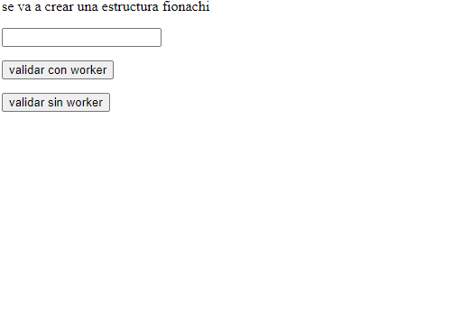
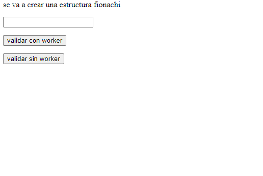

# Web Workers

En esta oportunidad quiero validar que comportamiento adopta nuestra UI cuando ejecutamos una función o evento muy pesado a nivel
de javascript y como este puede afectar nuestra UI y dar una mala impresión a nuestros usuarios.

## Escenarios

En este ejercicio lo que hacemos es ejecutar la Sucesión de Fibonacci donde el usuario puede interactuar y agregar hasta que ciclo quiere
que se ejecute esta función

### Con Worker

Al ejecutar la función con workers enviamos el numero **5000** para que nuestra función Fibonacci ejecutara, 
evidenciamos que la UI no se altera, pero mostramos un spinner para dar entender al usuario que algo está pasando.

### Sin Workers

Al ejecutar la función sin workers enviamos el numero **5000** pero en este caso la UI si se vio afectada ya que bloqueo el rendering de nuestro spinner y se desbloqueó después de que finalizo la función.

## Conclusión

Los web worker son poderosos cuando queremos hacer procesos pesados en el cliente y queremos que nuestra UI no se vea afectada por esto, es importante aclarar que debemos tener presente cuando si o si debemos usar esta tecnología, ya que esta genera un nuevo hilo de ejecución y si abrimos demasiados puede que afecte de igual forma.

esto lo veremos en otro ejemplo a futuro.
